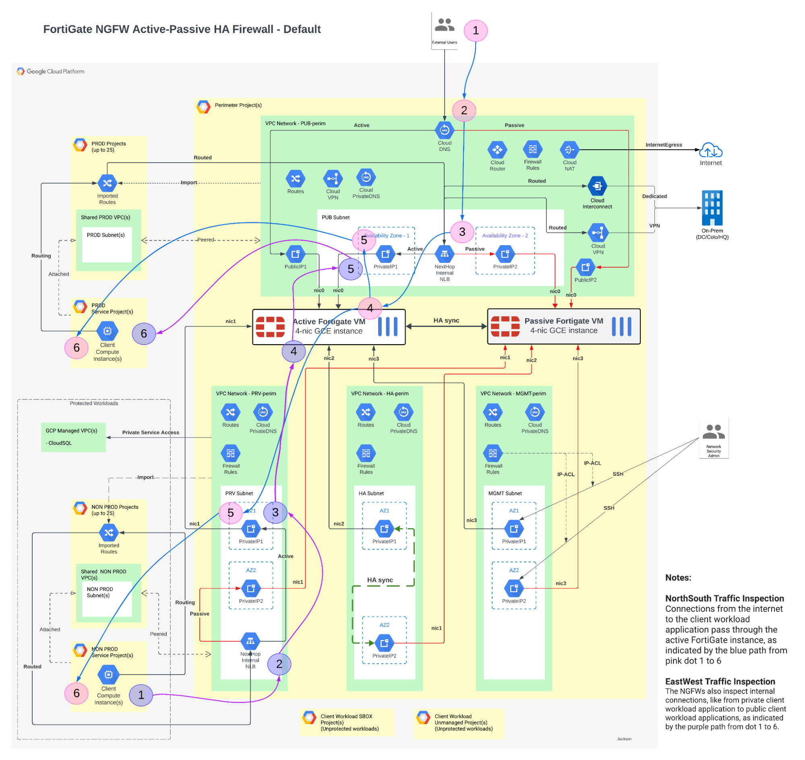
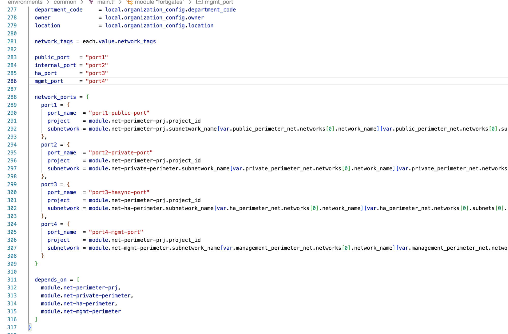
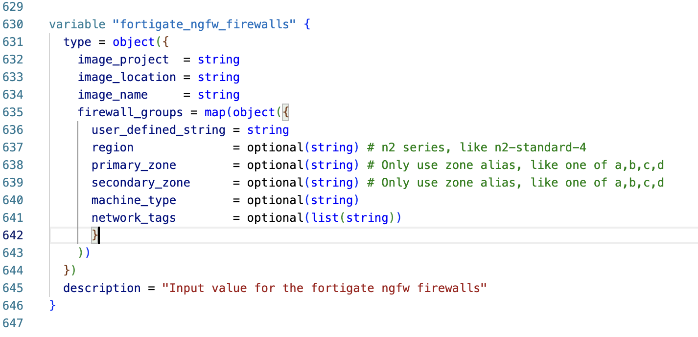
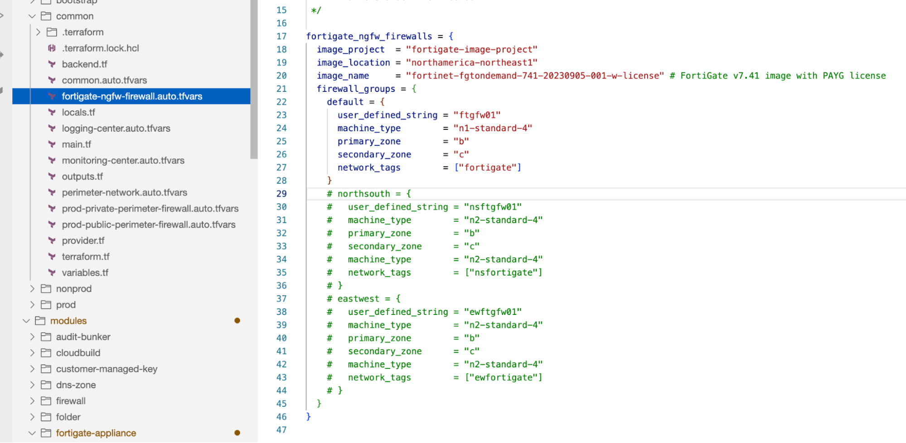
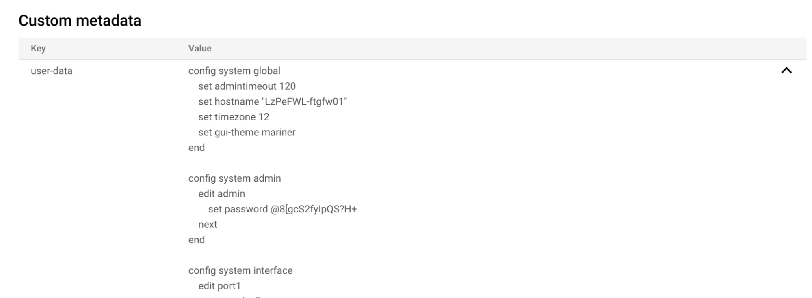

**Integrate FortiGate-VM NGFW HA solution with PBMM Secure Landing
Zone**

This guide shows you how to deploy a FortiGate NGFW YoppWorks default
reference architecture implementation to your landing zone to protect
your workload applications against cyberattacks.

FortiGate is a next-generation firewall (NGFW) with software-defined
wide area network (SD-WAN) capabilities deployed as a network virtual
appliance in Compute Engine. When deployed, FortiGate can help secure
applications by inspecting all inbound traffic originating from the
internet and outbound to internet and internal traffic between
applications and application tiers. You can use the same FortiGate
cluster as a secure web gateway to protect outbound traffic originating
from your workloads.

**Architecture**
-------------------

The following architectural diagram shows the FortiGate NGFW solution
architecture Yoppworks standard variation that consists of an HA cluster
of FortiGate NGFW VMs that uses external and internal load balancers as
next hop to direct traffic to the active FortiGate VM instance

[]

From the above diagram, we can see the North-South traffic connections
from the internet to the workload applications pass through the active
FortiGate instance, as indicated by the blue path. We can also see the
FortiGate NGFWs also inspect internal East-West traffic connections from
client workload applications and other internal services, as indicated
by the pink path.

The below is the variation of the above FortiGate architectural diagram
for initial networks of the PBMM landing zone for your reference.

[]

Similarly, the above reference architecture feature the following
building blocks:

-   Active-Passive HA Cluster
-   Peering-based hub and spokes
-   Supported user-cases

```{=html}
    -   Protecting public services - Ingress North-South Inspection
    -   Secure NAT Gateway - Egress NorthSouth Inspection
    -   Multi-Tier Infrastructure Segregation - East-West Inspection
    -   Secure Hybrid Cloud - IPS for InterConnect
    -   Private Service Connect
    -   SD-WAN and Remote Access
```
-   

**Design Consideration**
----------------------------

There are a few design limitations that led to the current design

-   GCP requires the use of instance groups to be able to use load
    balancers on

interfaces other than nic0. Each virtual appliance has unique metadata
that is

used for the startup configuration, so static instances were used to
accomplish this.

-   The On-Demand image requires the appliance be able to access the
    internet on

    it's default port (nic0). In the example the appliances a GCP Cloud
    NAT is created to provide internet access without giving the instance a public IP

-   Currently the \`nic3\` (connected to the mgmt vpc) is open to
    management because \`Identity Aware Proxy (IAP)\` requires
    connecting to \`nic0\` on the instance. This can and should be
    locked down in the appliance to only allow the IAP IP address range
    on this port.

**Cost**
-----------

FortiGate VM for Google Cloud supports both on-demand pay-as-you-go
(PAYG) licensing and bring-your-own-license (BYOL) models.

PAYG is the most flexible type of licensing available for FortiGates in
the public cloud. PAYG licensing is linked to the machine type used to
run FortiGate VMs. License fee is calculated per hour of instance
running based on the below pricing sheet and added to the Google Cloud
invoice. To stop charges it is enough to stop the instances.

[]

The above FortiGate PAYG license price may be changed. Please visit the
pricing tab of the GCP marketplace product Next-Generation Firewall
(PAYG)(https://www.google.com/url?q=https://console.cloud.google.com/marketplace/product/fortigcp-project-001/fortigate-payg?organizationId%3D0%26supportedpurview%3Dproject&sa=D&source=editors&ust=1709660657494280&usg=AOvVaw32qikgu9lBfG0FgfefdJzJ) for
latest prices.

As for BYOL license prices, you can obtain the information from any of
below ways:

-   GCP marketplace product FortiGate Next-Generation Firewall
    (BYOL)(https://www.google.com/url?q=https://console.cloud.google.com/marketplace/product/fortigcp-project-001/fortigate?organizationId%3D0%26supportedpurview%3Dproject&sa=D&source=editors&ust=1709660657494827&usg=AOvVaw0AU0tkXDdIe0O-PBCBbdoJ)
-   FortiGate-VM on GCP Order
    Type(https://www.google.com/url?q=https://docs.fortinet.com/document/fortigate-public-cloud/7.0.0/gcp-administration-guide/451056/order-types&sa=D&source=editors&ust=1709660657495126&usg=AOvVaw2sWhfprhwdBHMDTCc7SCyz)
-   FortiGate Support(https://www.google.com/url?q=https://www.fortinet.com/support/contact&sa=D&source=editors&ust=1709660657495381&usg=AOvVaw09FV3KqQmSWfF5Ey-JOnqF)

Note that besides FortiGate license fees you will have to cover the
costs of the following GCP infrastructure:

-   2 VM instances supporting 4 or more NICs
-   Forwarding rules
-   inter-zonal heartbeat traffic
-   VM disk storage

Use Google Cloud Pricing Calculator (https://www.google.com/url?q=https://cloud.google.com/products/calculator/%23id%3D41ff2e84-f518-4b22-a396-71effe7682db&sa=D&source=editors&ust=1709660657495988&usg=AOvVaw1PJKjNKwyEXU7XFkqUluWl)for
cost estimates.

**License**
--------------

For BYOL model, you need to obtain your license from FortiGate or its
local reseller first and then upload the license files to the below
terraform folder and these files are referenced when deploying instances
for license provisioning.

[]
To obtain your production-ready or evaluation licenses, contact your
local Fortinet reseller.

For PAYG mode,  special PAYG boot images published by Fortinet are
required to be used. All images with names containing \"ondemand\" or
family name including \"payg\" published in **fortigcp-project-001** project are PAYG images.

To deploy a cluster with PAYG licensing, set a proper value for
image\_name or family\_name variables. By default the FortiGate module
deploys the newest firmware in PAYG licensing.

(TODO: Figure out the image with the FortiGate cluster license)

**Terraform**
----------------

The FortiGate module is integrated with the Yoppworks PBMM secure
landing zone at the common root module. As shown from the above standard
architecture diagram,  four VPC networks will be required to build such
a landing zone with the FortiGate NGFW solution. To enable the FortiGate
solution, we need to follow the below steps.

**Step1: Plan networks and IP addresses**
--------------------------------------------------

It is recommended by FortiGate to use the IP range 172.16.0.0/16 for
the FortiGate Firewall hub VPCs.

It must be ensured that there is not any IP address overlapping between
Fortigate hub VPCs and workload VPCs.

In the best practice, for enterprise clients, it is recommended to use
10.0.0.0/8 for your workload VPCs.

Please refer to the above architecture diagram for networking
topology.

The below IP tools can be used to plan your IP addresses for those
networks.

-   [Visual Subnet
    Calculator](https://www.google.com/url?q=https://www.davidc.net/sites/default/subnets/subnets.html&sa=D&source=editors&ust=1709660657497451&usg=AOvVaw2ZiwTkzCF9r6sGL9bblhKS)
-   [Advanced Subnet
    Calculator](https://www.google.com/url?q=https://www.solarwinds.com/free-tools/advanced-subnet-calculator&sa=D&source=editors&ust=1709660657497736&usg=AOvVaw18LI4U0ekKu-tbXPqg2XMB)

**Step2: Define network project**
-----------------------------------------

In the common module, you can define a GCP project for network hub VPCs
used for the Fortigate NGFW solution as shown in the below
screenshot.

[]

**Step3: Define perimeter hub VPCs**
--------------------------------------------

In command module, the below four VPCs need to be defined for FortiGate
NGFW solution deployment:

-   Public(External) perimeter VPC
-   Private(Internal) perimeter VPC
-   HA Sync perimeter VPC
-   HA Management perimeter VPC

In the main.tf,  the network module can be used to define the above
VPCs as shown below.

[]

And then, in the file perimeter-network.auto.tfvars,  provide variable
values for each of those VPCs like below.

[]

**Step4: Define the Fortigate module instance**
-------------------------------------------------------

To enable the FortiGate solution, we need to make sure the
fortigate-appliance module is used to define the given Fortigate
Active-Passive HA solution in the main.tf of the common root module.

The below shown module instance is commented out by default so you need
to uncomment it when you need such a FortiGate solution.

[]

[]

**Step5: Define variable for the Fortigate module instance**
--------------------------------------------------------------------

We also need to add the variable parameter into the variable.tf under
the common root module as shown below first.

[]

**Step6: Provide variable values for the Fortigate module instance**
----------------------------------------------------------------------------

You need to provide variable values in a separated auto.tfvars file,
like "[fortigate-ngfw-firewall.auto.tfvars]

[]

Please note that, in the practice, for devtest purpose, you may want to
deploy or only destroy this FortiGate solution instance. You can just
comment out selected firewall groups to destroy deployed resources of
the FortiGate solution. If you want to deploy it again, just uncomment
it and then apply changes.

**Deployment**
-----------------

Please follow the standard terraform deployment procedure to deploy the
command.You just need to submit the code changes to the CSR repository
to trigger the cloud build jobs for root module deployments.

You can validate your code change by the below commands before you
submit it to your CSR repository:terraform init; terraform
validate;

**Validation and Configuration**
-------------------------------------------

Once the common root module is deployed successfully, you should be
able to see the FortiGate GCE VMs from the GCP console as shown below.

[]

Then you can connect to each of the GCE VMs to obtain the FortiGate
product serial number like below. The product serial number will be used
to request a BYOL license from Fortigate company.

[]

[]

Then you can open the custom metadata section and find the login
password from the instruction about set password as shown below.

[]

You can also open the FortiGate web GUI at the public ip address of
each GCE VMs if your network firewall policy allows the incoming
internet traffic to those VMs. The login GUI will look like the screen
below. You can then login with admin as username and the above found
password as password.

[]

Then you will see the FortiGate web GUI homepage like below.

[]

By the way, once we can manage and operate FortiGate VMs by FortiOS
provider from terraform solution, we may not need to login to the web
GUI to manage the firewall config and rules at most of the time.

**Known Issues**
-------------------

The current FortiGate NGFW module is originally from GCP PBMM landing
zone under the below path:

pbmm-on-gcp-onboarding/modules/fortigate-appliance at main ·
GoogleCloudPlatform/pbmm-on-gcp-onboarding
(github.com)(https://www.google.com/url?q=https://github.com/GoogleCloudPlatform/pbmm-on-gcp-onboarding/tree/main/modules/fortigate-appliance&sa=D&source=editors&ust=1709660657501079&usg=AOvVaw0Eu_6lDfEkFUZcz2wWi37N)

We are using the local copy of the above module at the Yoppworks repo
under below path:

pbmm-on-gcp-secure-onboarding/modules/fortigate-appliance at main ·
yw-liftandshift/pbmm-on-gcp-secure-onboarding
(github.com)(https://www.google.com/url?q=https://github.com/yw-liftandshift/pbmm-on-gcp-secure-onboarding/tree/main/modules/fortigate-appliance&sa=D&source=editors&ust=1709660657501428&usg=AOvVaw07R40jxQNIsUgDoeGZ9Uuc)

The below issues had been found from the the above modules:

-   Random string does not include any numbers required by vm naming.
-   Fortigate-appliance module validation error caused by virtual machine module error.
-   Naming conflict issue of FortiGate VM osdisk and datadisk.
-   Path and Virtual-machine module used by fortigate-appliance module.
-   Hardcoded port issue from fortigate-appliance module.
-   FortiGate module virtual machine zone argument issue (not parameterized).
-   FortiGate firewall image project and name variable issue from fortigate-appliance module.
-   Network and subnet data are unavailable from outputs of network and subnet modules.
-   Fortigate firewall configuration is not managed by terraform.

**Completed Changes**
------------------------

The below issues have been fixed for FortiGate solution modules at the
YoppWorks repo:

-   Fixed the issue that the random string does not include any numbers required by naming.
-   Fixed the virtual machine module errors.
-   Fixed name patterns for vm osdisk and datadisk.
-   Fixed the virtual-machine module path issue in the fortigate-appliance module.
-   Refactored the zone variable used by fortigate-appliance virtual machines.
-   Refactored the port variable used by fortigate-appliance virtual machines.
-   Refactored the image location and image variable used by fortigate-appliance virtual  machines.
-   Duplicated the FortiGate VM image to the restricted location.
-   Exported network and subnets values from outputs of module network and subnets.
-   Completed FortiGate NGFW Firewall standard solution architecture for Yoppworks PBMM landing zone standard enterprise-level network topology
-   Completed FortiGate NGFW Firewall solution architecture for GCP PBMM landing zone default networks.
-   Integrated the fortigate-appliance module with the default networks from the GCP PBMM common root module.
-   Whitelist organizational policies required by FortiGate NGFW at the network perimeter project level.
-   Build next hop network balancers for Fortigate firewall vms backends.
-   Document FortiGate solution user guide.

**Planned Changes**
----------------------

The below issues have been planned to be done for the FortiGate NGFW
solution at the YoppWorks repo:

-   Build Fortigate NGFW Firewall cluster with auto-scaling.
-   Connect to FortiGate VMs by FortiOS provider.
-   Automate the FortiGate Firewall password generation from GCP Secret Manager.(Optional)
-   Externalize and load BYOL license from GCP Secret Manager.(Optional)
-   Design and build use-case-based FortiGate firewall rule modules.    
-   Build Fortigate module to support YoppWorks standard PBMM networks and workload.
-   Build FortiGate rules for basic security
-   Build FortiGate rules for standard security(Optional)
-   Build FortiGate rules for enterprise-level security scenarios(Optional)
-   Enhanced FortiGate NGFW solution to support 8 NICs.
